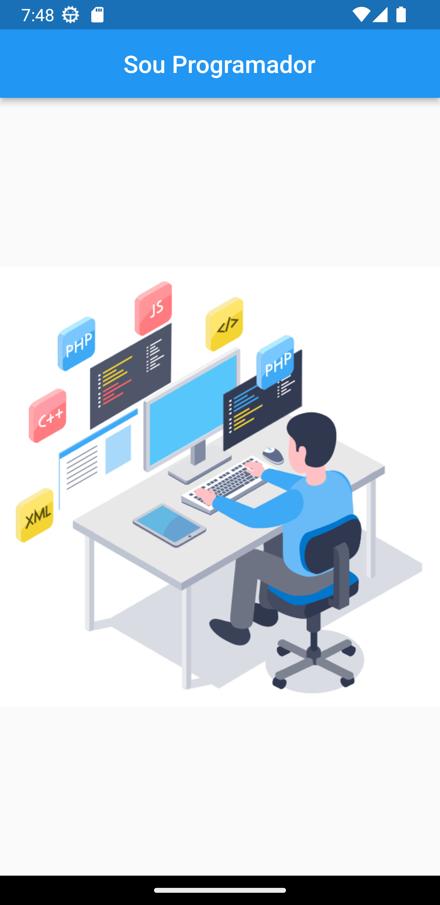

# Projetos_Flutter_BootCamp
 Apps criados com o intuito de fixar o aprendizado em Flutter.

<h1>App "Sou Programador"</h1>
Esse app apenas exibe uma TopBar e uma imagem e foi criado para entender os conceitos de widgets usados pelo Flutter.

